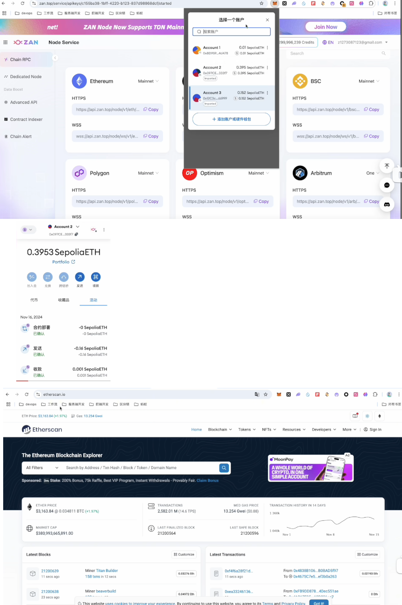

第四节：如何从 Go 开发顺利转型 Web3
2024-11-27 14:52:58
https://www.bilibili.com/video/BV1HABQY7EE2?spm_id_from=333.788.videopod.sections&vd_source=4212b105520112daf65694a1e5944e23

# 讲师简介
Pignard
Twitter:@pignard_web3
·某大厂区块链技术专家&研究员
·以太坊Buidler，数十个Dapp开发经验
·Web3自媒体博主，公众号《小猪Web3》
·熟悉主流公链和Web3项目
witter:@OpenBuildxyz

# 目录contents
01Go 在 Web3 中的应用
02以太坊基础知识
03DApp后端开发
04区块链底层开发

# 01Go 在 Web3 中的应用
* 开发者岗位
> 前端开发及全栈开发（岗位最多）
> 智能合约开发
> **后端开发**
> **区块链底层开发** （rust的区块链底层开发岗位更多）
> **节点服务（*数据）**（需求更少）
> 合约审计（*安全）

* 转型Web3
> ·学习以太坊基础知识
> ·DApp后端开发：
>     ·学习使用Go语言连接以太坊
>     ·学习使用Go语言交互智能合约（前置学习Solidity）
> ·区块链底层开发：
>     ·学习Geth（包含EVM）源码

# 02以太坊基础知识

## 什么是以太坊
> ·以太坊是一个去中心化的区块链平台，它建立了一个对等网络，可以安全地执行**智能合约**。
> ·智能合约允许参与者在没有受信任的中央机构的情况下相互进行交易。交易记录不可更改、
> 可验证，并且安全地分布在网络上，为参与者提供对交易数据的完全所有权和可见性。
> ·交易发送者必须签署交易并使用**以太币（$ETH）**，作为在网络上处理交易的**燃料费（Gas）**。

## 以太坊网络
·以太坊主网是指主要的以太坊生态区块链，所有具有实际价值的交易都发生在该链的分散账本中。大众和交易所涉及的以太币价格是主网以太币。

·以太坊测试网：这是一种模拟生态环境的网络，协议智能合约开发者可以使用它们测试尚未部署在主网上的协议升级和智能合约。测试网上的以太币被认为是没有实际价值的。
* **Sepolia是应用程序开发时推荐使用的默认测试网**

## 外部账户
外部账户（Externally Owned Account, EOA)由一把私钥与该私钥对应的公开地址来表示。在一般情况下，私钥掌握在用户的手中，用于交易签名。
 

## 合约账户
合约账户(Contract Account, CA )没有私钥，仅有公开的地址，它的行为由合约自身包含的代码逻辑来控制。

Code:以太坊协议规定了一种运行在以太坊虚拟机之上的**字节码**，并在其之上构建了中间语言**Yul/Yul+**，在中间语言之上再次构建了Solidty等高级语言。
Storage:合约的状态是被逐项存储的（动态数组和映射除外），从第一个状态变量开始，它被存储在**槽0**中。

## 交易和区块
区块：包含交易的集合并记录了以太坊的世界状态。
交易：一个外部账户转移一定资产给某个账户，或者发出一个消息到某个智能合约。

book：《以太坊的技术与实现》

# 03 DApp后端开发

## 什么是Geth
Go-ethereum，也被简称为Geth，是最流行的以太坊**执行客户端（占比大概46.6%）**。
当使用Go语言开发应用程序时，Geth提供了读写以太坊区块链的一切功能。

* ·执行客户端 侦听网络中广播的新交易，并在以太坊虚拟机中执行它们，并保存所有当前以太坊数据的最新状态和数据库；常用的执行客户端除了Geth还有Reth(Rust)和Besu(Java）；
* ·共识客户端 实现权益证明共识算法，使网络能够根据来自执行客户端的经验证数据达成一致。（remark:开发中很少用到）。

## 学习使用工具
·使用钱包 
     
·使用区块链浏览器
      sepolia测试网浏览器 https://sepolia.etherscan.io/
      主网浏览器 
      IDE:  
·使用Remix
   
·使用节点
   zan.top
·使用水龙头

## 开发实战（1）
查询最新区块高度
·查询区块
·查询交易
·查询交易回执
查询GasPrice

# 04 区块链底层开发