第五节：如何从 Web2 Rust 开发顺利转型 
2024-12-03 18:24:29
https://www.bilibili.com/video/BV1sozmYmEeS/?spm_id_from=333.788.videopod.sections&vd_source=4212b105520112daf65694a1e5944e23
👉 https://openbuild.xyz/learn/challenges/2050911877 免费报名本课程及加入求职交流群！

OpenBuild 社区携手 Web3 招聘平台 SmartDeer 定制 Web3 转型求职公开课！ 带你一站式了解 Web3 生态，提供从技术到职业的全方位指导。无论你是前端开发、Python、Java、Rust还是 C++ 背景，课程中都有为你量身定制的转型学习路线！ 导师们将结合真实案例，分享他们的转型故事和避坑指南，帮你轻松避开那些“踩雷”环节。

# 老师简介
 
* 当前的状态
    ·某链核心开发者，负责节点服务器开发、JSON-RPC、P2P、存储等。
    ·开源项目Amphitheatre作者，目前重心是支持区块链和Web3的技术栈。
* 我的技术栈
    ·多种语言编程能力，包括 Rust、Java、Go、Python、JS/TS、C/C++、PHP 等生产级开发经验。
    ·在分布式、通信协议、微服务、架构设计和数据建模方面经验丰富，近两年来关注容器化，云原生，Kubernetes。
    ·在区块链领域，主要编程语言是 Rust，近期在研究学习编译器和虚拟机。
* 联系方式
    · Github: https://ithub.com/wangeguo
    . Twitter:https://x.com/wangeguo

## 历程-BlockchainDeveloper
·Web开发 vs 合约开发 vs 链开发
·初进入时，要花许多时间在某个具体模块上，比如 RPC，要调研行业惯例、竞品方案、相关实现/库/工具等等，就像游戏里的战争迷雾。  
区块链的模块化和架构大同小异，一番“攻城略地"后，总会在大脑中建立一棵知识体系的树。  

## 历程- Compiler & VM "Researcher"
 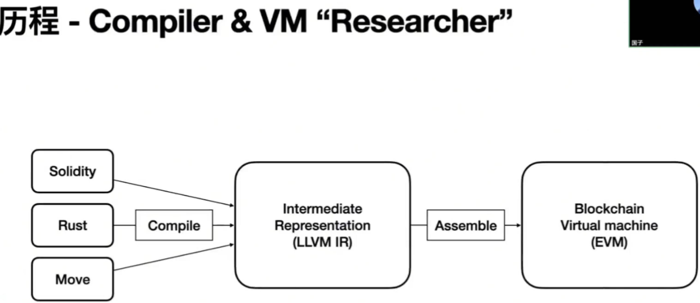

# 渠道
黑客松 ,项目中文社区, 开源项目, DAO, 社区, 媒体

# 视角 
视角－交易执行路径  

视角－链的模块化单元 
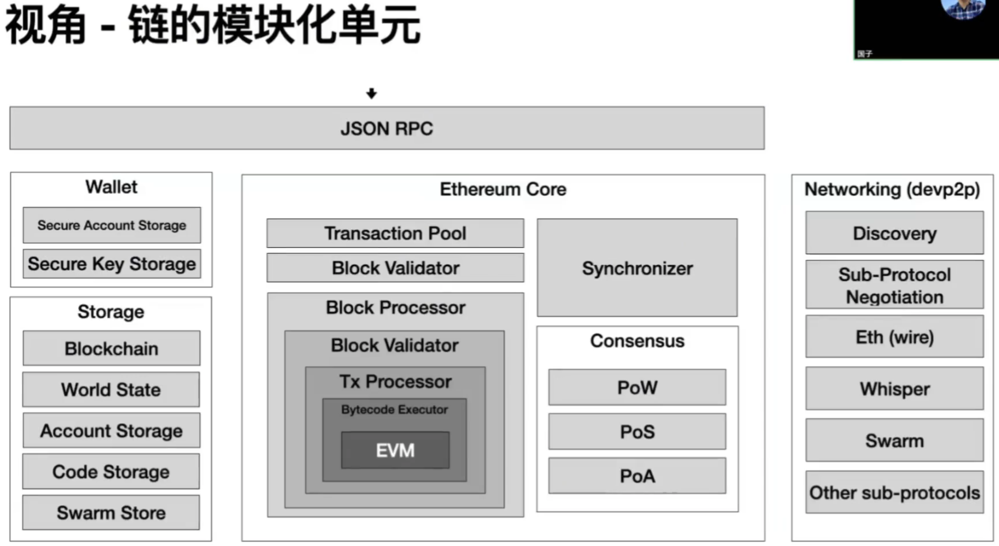

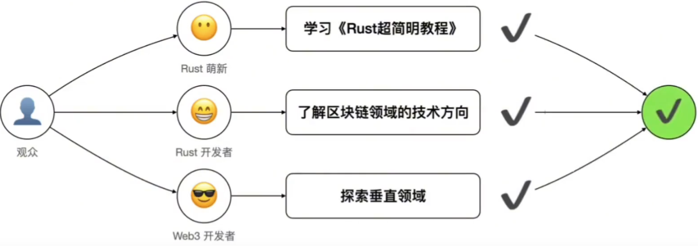

# 智能合约编程语言

## 智能合约编程语言-Solidity
 
一种静态类型的花括号编程语言，专为开发在以太坊上运行的智能合约而设计
·文档及示例
· https://soliditylang.org/
· https://solidity-by-example.org/

·编译器及实现
·Solang - Solidity Compiler for Solana and Polkadot https://solang.readthedocs.io/
·Solar-Blazingly fast, modular and contributor friendly Solidity compiler, written in Rust. https://github.com/paradigmxyz/solar
·soLL -Compiler for generating Ewasm(Ethereum flavored WebAssembly) files from Solidity and Yui https://github.com/second-state/SOLL 
·revmc-Experimental JIT and AOT compiler for the Ethereum Virtual Machine https://github.com/paradigmxyz/revmc

 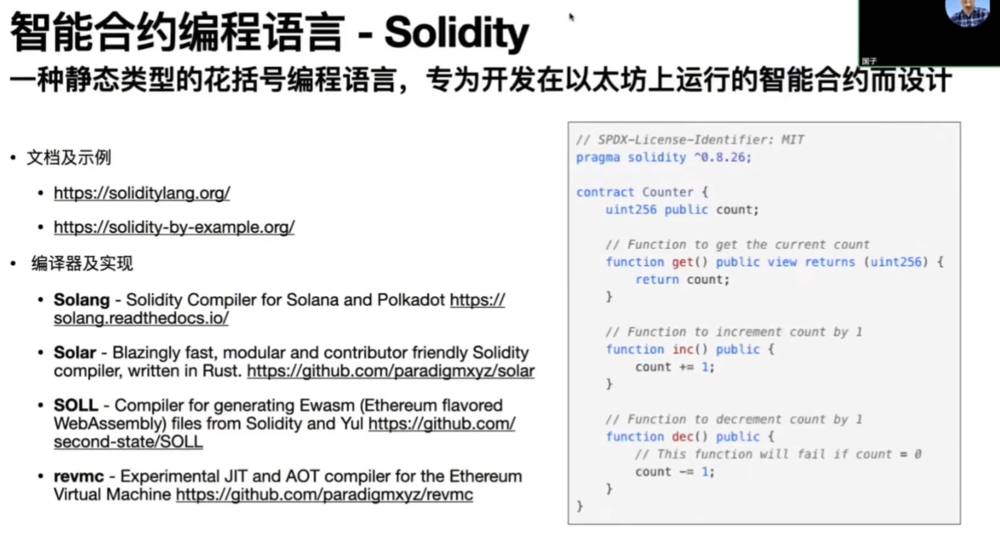
## 智能合约编程语言－Move
用于安全、沙盒化和形式化验证编程的下一代语言，Move借鉴了Rust的理念

* Move On Aptos https://github.com/move-language/move-on-aptos
* Move on Sui https://github.com/move-language/move-sui
* Move on Starcoin https://cookbook.starcoin.org/docs/move/move-language/
* Move onRoochhttps://rooch.network/learn/core-concepts/move-contracts/move-on-rooch

 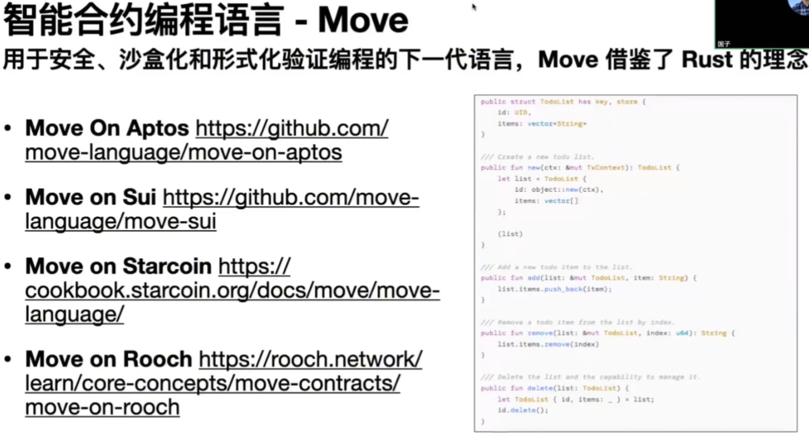

## 智能合约编程语言－Cairo
受 Rust启发的语言，利用有效性证明的功能可以轻松构建可扩展的dApp

·Cairo让您无需深入了解底层ZK概念即可编写可证明的程序。从链上游戏到可证明的 ML,Cairo使构建无需信任的应用程序成为可能。
·Cairo也是Starknet（一种通过以太坊验证的L2 区块链）的智能合约语言。

* 文档与示例
    https://www.cairo-lang.org/
    https://book.cairo-lang.org/

 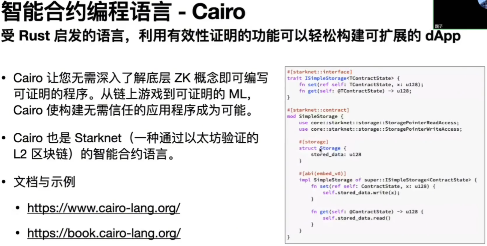

## 智能合约编程语言-Sway
Sway是为Fuel区块链开发的一种语言。它深受Rust的启发，旨在为区块链生态系统带来现代语言开发和性能

·Solidity是备受推崇的先驱，但它受制于EVM的许多历史怪癖。它缺乏程序员所期望的常见功能，类型系统相对缺乏表现力，并且缺乏统一的工具生态系统。
·虽然Rust 是一种出色的系统编程语言（Sway本身也是用Rust 编写的），但它并不适合智能合约开发。
·Sway试图通过提供熟悉的语法和适合区块链环境特定需求的功能，为智能合约开发人员带来Rust的所有其他优势，包括其现代类型系统、安全方法和良好的默认值。

·文档与示例
    ·https://docs.fuel.network/docs/sway/
    ·https:/fuellabs.github.io/sway/master/reference/
    ·https://sway-by-example.vercel.app/
    ·https://github.com/FuelLabs/sway-examples/

 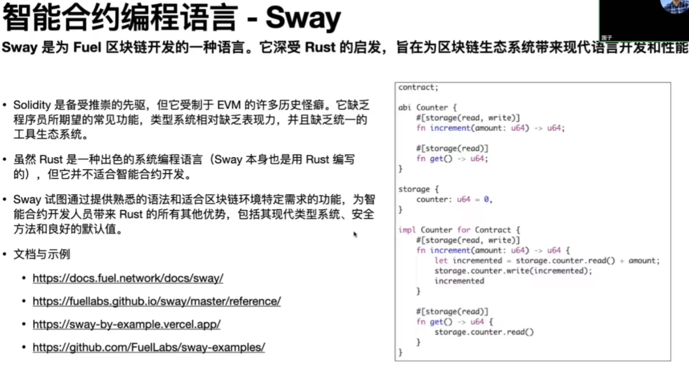

## 智能合约编程语言-Rust-ink!
ink！是一种用于智能合约的编程语言。您可以将其与基于Substrate构建的区块链一起便用。

·ink!是一种用于智能合约的编程语言一一它是
使用Substrate框架构建的区块链可以选择
的几种语言之一。它是一种有主见的语言，
我们 Parity 通过扩展流行的 Rust 编程语
言，为其添加所需的功能以使其兼容智能合
约来构建它。

·文档与示例
    · https://use.ink/
    · https://use.ink/examples/smart-contracts
 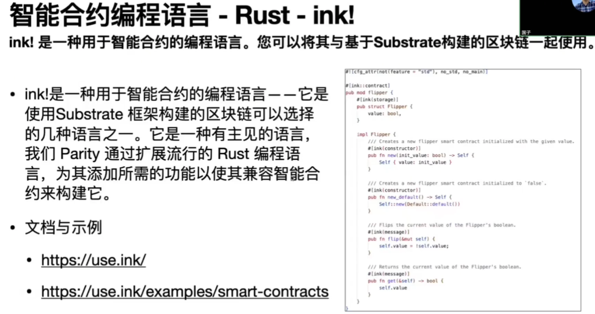

## 智能合约编程语言-Rust-Anchor
Anchor是一个用于快速构建安全Solana程序(有时称为“智能合约")的框架

·Anchor 程序由三部分组成。模块program、标记为 的 Accounts 结构#[derive(Accounts)]和
declare_id宏。program模块是您编写业务逻辑的地方。Accounts 结构是您验证帐户的地方。
declare_id宏创建一个ID存储程序地址的字段。Anchor使用此硬编码iD进行安全检查，它还允
许其他包访问您程序的地址。

·文档与示例
    ·https://www.anchor-lang.com/
    ·https://examples.anchor-lang.com/

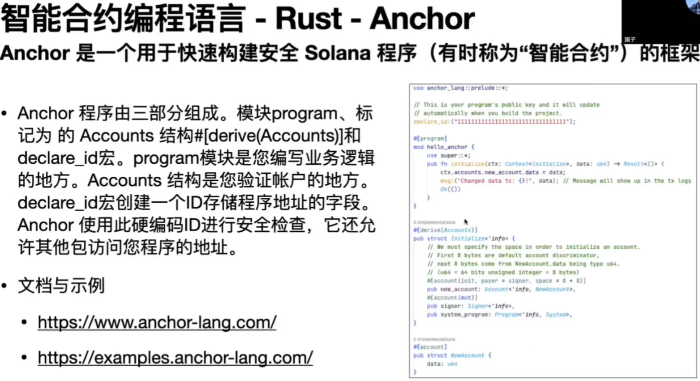

## 智能合约编程语言-Rust-Sails
Sails是一个库，可让您使用GearProtocol编写应用程序的体验更简单、更清晰

·无需编写一些低级样板代码，让您可以专注于业务问题
·为您的应用程序生成IDL文件
·生成的客户端允许使用不同语言编写并在不同运行时执行的代码与您的应用程序进行交互

·文档与示例
    ·https://github.com/gear-tech/sails
    ·https://wiki.vara.network/docs/build/sails
    ·https://github.com/gear-tech/sails/tree/master/examples

 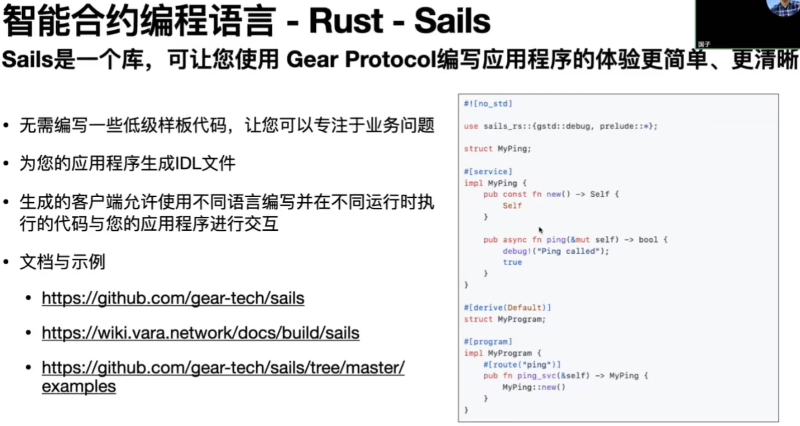

#  客户端SDK
55:01
Send queries to RPC nodes, build and sign transactions, and interact with network

·web3.js -Ethereum JavaScript API https://web3js.readthedocs.io

· ethers.js - Complete Ethereum library in JavaScript https://ethers.org/

· alloy-rs - Alloy implements high-performance, well-tested & documented libraries for interacting with Ethereum and
other EVM-based chains https://github.com/alloy-rs

· Rust Client for Solana - Program, SDK and Client crates https://solana.com/docs/clients/rust

·fuels-rs-FuelNetworkRustSDKhttps://github.com/FuelLabs/fuels-rs

·Sui Type Script SDK-a modularlibraryof tools for interacting with the Sui blockchain. Use it to send queries to RPC
nodes, build and sign transactions, and interact witha Sui or local network https://sdk.mystenlabs.com/typescript
·Sui Rust SDK-provides the Sui Rust SDK, containing APls to interact with the Sui network
   https://docs.sui.io/references/rust-sdk

# RPC-jsonrpsee
基于async/await的Rust JSON-RPC库 （remark: 很流行）
 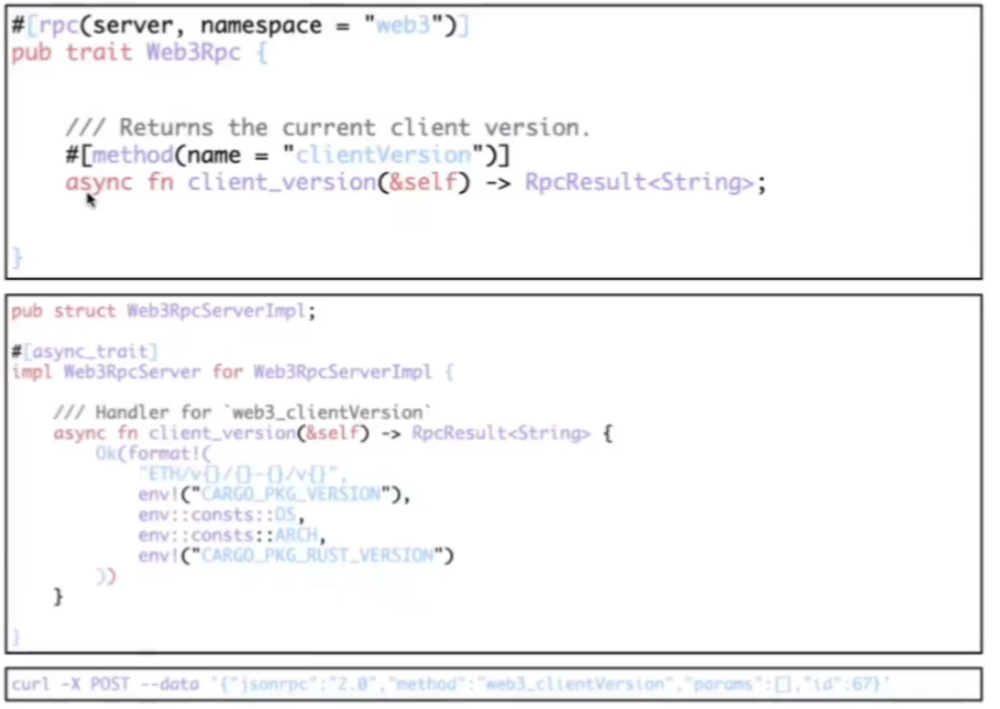

* 特征
    ·客户端/服务器HTTP/HTTP2支持
    ·客户端/服务器WebSocket支持
    ·通过web-Sys支持客户端WASM
    ·客户端传输抽象以提供自定义传输
    ·中间件

* 应用案例
paritybridgescommon,remoteexternalities,polkadot-idk,substrate-api-client,subwasm,subway,submit,Trin,Uptest,zkSyncEra,Forest...

* 网站及文档
    https://github.com/paritytech/jsonrpsee
    https://docs.rs/jsonrpsee

#  P2P-libp2p

一个模块化的点对点网络框架
 

* ·libp2p是一个开源网络库，被以太坊、IPFS、Filecoin、Optimism 等世界上最重要的分布式系统使用。
* ·Go、Rust、Javascript、C++、Nim、Java /Kotlin、Python、.Net、Swift 和 Zig都有原生实现。
* ·它是全球规模点对点网络最简单的解决方案，包括对发布-订阅消息传递、分布式哈希表、NAT漏洞打孔和浏览器到浏览器直接通信的支持。
* 项目：
    网站    https://libp2p.io/
    rust-libp2p:  https://github.com/libp2p/rust-libp2p/
    文档:   https://docs.rs/libp2p/latest/libp2p/

# 执行器&虚拟机
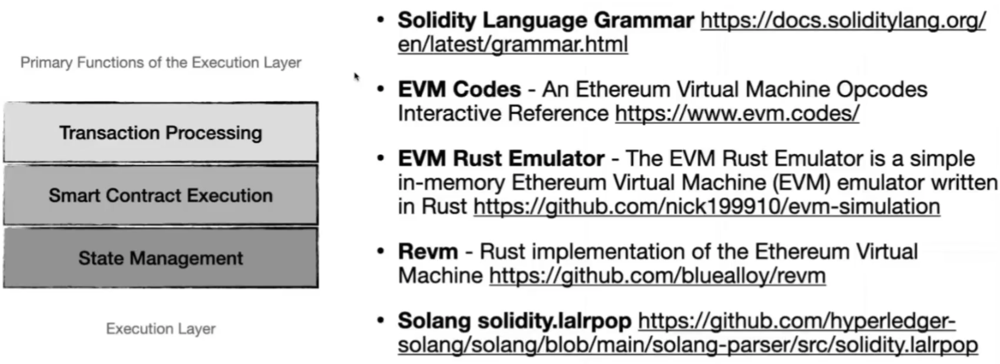

·Solidity Language Grammarhttps://docs.soliditylang.org/en/latest/grammar.html

·EVM Codes - An Ethereum Virtual Machine Opcodes Interactive Reference https://www.evm.codes/

·EVM Rust Emulator-TheEVM Rust Emulator is a simple in-memory Ethereum Virtual Machine (EVM) emulator written in Rust, https://github.com/nick199910/evm-simulation

·Revm-Rustimplementationof the Ethereum Virtual Machine https://github.com/bluealloy/revm

·Solang solidity.lalrpop  https://github.com/hyperledger-solang/solang/blob/main/solang-parser/src/solidity.lalrpop

# 共识算法-综述
1:03:14
确保网络中所有节点达成一致，并提供安全和高效的交易验证和区块生成机制

·工作量证明（PoW）-要求参与者解决复杂的数学难题来验证交易并创建新的区块。
·权益证明（PoS）－验证者根据持有的代币数量和愿意抵押的代币来创建和验证新的区块。
·委托权益证明（DPoS）－PoS的变种，持币者投票选出少数代表负责验证交易和创建区块。
·权威证明（PoA）-验证者根据身份和声誉而非经济抵押被选择。通常用于私有或联盟区块链。
·空间证明（PoSpace）－验证者证明已分配一定量的磁盘空间用于存储，而非计算能力或抵押。
·燃烧证明（PoB）-参与者将代币发送到一个地址，这些代币将被永久烧毁（从流通中移除），以获得挖矿或验证区块的权利。
·流逝时间证明（PoET）－网络中的节点等待一个随机选择的时间段，第一个完成等待的节点获得挖掘下一个区块的权利。
·实用拜占庭容错（PBFT）-要求预定群体的节点（验证者）达成共识以验证交易。
·委托拜占庭容错（dBFT）-通过引I入委派机制扩展了BFT，网络参与者投票选举负责验证交易和添加区块的代表。

## BFT
 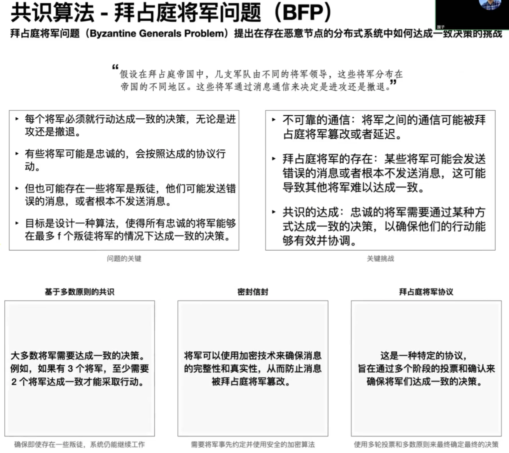

共识算法－拜占庭将军问题（BFP）
拜占庭将军问题（Byzantine Generals Problem）提出在存在恶意节点的分布式系统中如何达成一致决策的挑战。
    ”假设在拜占庭帝国中，几支军队由不同的将军领导，这些将军分布在帝国的不同地区。这些将军通过消息通信来决定是进攻还是撤退。”

问题的关键：
* 每个将军必须就行动达成一致的决策，无论是进攻还是撤退。
* 有些将军可能是忠诚的，会按照达成的协议行动。
* 但也可能存在一些将军是叛徒，他们可能发送错误的消息，或者根本不发送消息。
* 目标是设计一种算法，使得所有忠诚的将军能够在最多f个叛徒将军的情况下达成一致的决策。

关键挑战
* 不可靠的通信：将军之间的通信可能被拜占庭将军篡改或者延迟。
* 拜占庭将军的存在：某些将军可能会发送错误的消息或者根本不发送消息，这可能导致其他将军难以达成一致。
* 共识的达成：忠诚的将军需要通过某种方式达成一致的决策，以确保他们的行动能够有效并协调。 

解决方法：
* 基于多数原则的共识 ：大多数将军需要达成一致的决策。例如，如果有3个将军，至少需要2个将军达成一致才能采取行动。确保即使存在一些叛徒，系统仍能继续工作
* 密封信封：将军可以使用加密技术来确保消息的完整性和真实性，从而防止消息被拜占庭将军篡改。需要将军事先约定并使用安全的加密算法
* 拜占庭将军协议：这是一种特定的协议，旨在通过多个阶段的投票和确认来确保将军们达成一致的决策。使用多轮投票和多数原则来最终确定最终的决策

## 共识算法-实用拜占庭容错（PBFT）
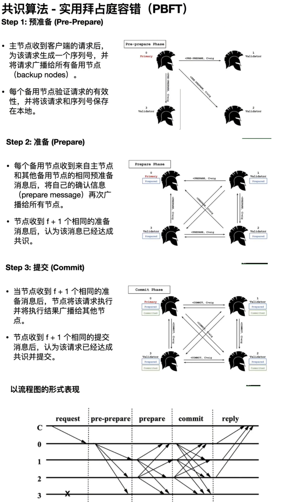

# Ethereum数据结构及存储
主要数据结构、关系与持久化存储
 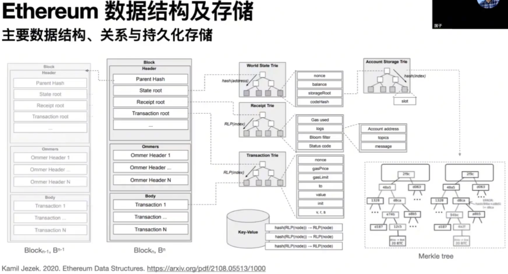

# DevOps-可观测性
OpenTelemetry is a collection of tools, APIs, and SDKs used to nstrument, generate, collect, and export telemetry data.
 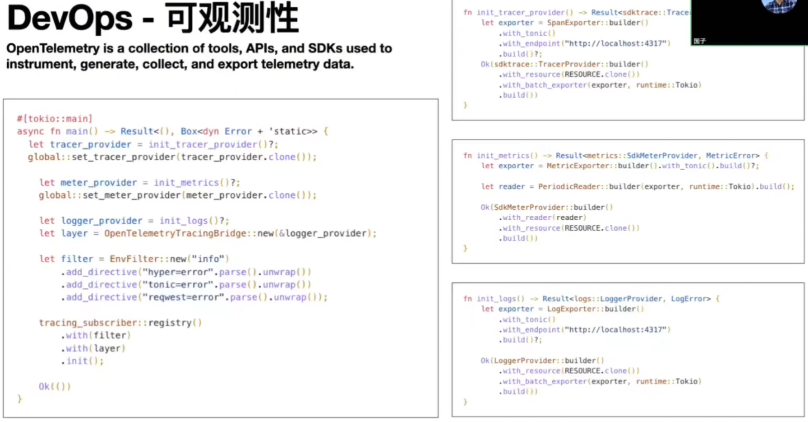

# DevOps-云原生
 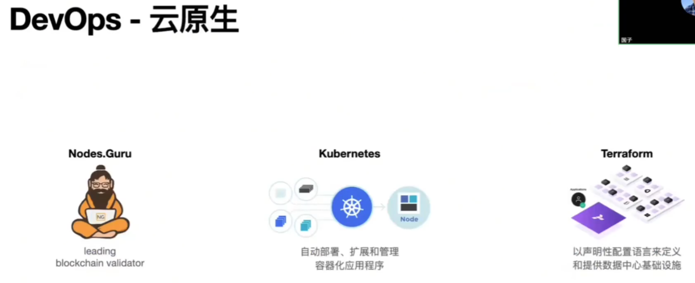

# Awesome Blockchain Rust
Useful components for building blockchains in Rust. include: cryptography, distributed, p2p, Consensus, etc
· Aleo https://github.com/AleoNet
· Aptos https://github.com/aptos-labs
· Reth https://github.com/paradigmxyz/reth
· Filecoin https://github.com/filecoin-project
· Fuel https://github.com/FuelLabs
· Gear https://github.com/gear-tech
· Rooch https://github.com/rooch-network
· Starcoin https://github.com/starcoinorg
·Starknet https://github.com/keep-starknet-strange/awesome-starknet
·Polkadot & Substrate https://github.com/paritytech
·Solana https://github.com/solana-labs
·Sui https://github.com/MystenLabs

浏览更多： https://github.com/rust-in-blockchain/awesome-blockchain-rust